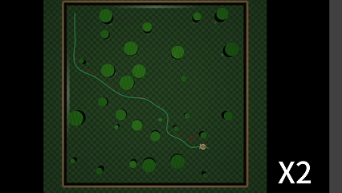

# Demo of MINCO Planner


# Differential Flatness Based Trajectory Planning

This repository builds on the original [`m0`](planning/README.md) MuJoCo-based
single/multi-agent simulation platform and adds a MINCO trajectory planning
module for differential-drive robot navigation in cluttered 2-D scenes.

The original `m0` project provides the simulation scaffold: robot models,
MuJoCo scenes, sensing utilities, controllers, classical planners such as A*
and RRT, and reinforcement-learning examples. This repository keeps that code
under [`planning/`](planning/) and extends it with
[`m0.minco_planner`](planning/m0/minco_planner/), a reusable planning pipeline
that connects grid-map search, safe trajectory optimization, MuJoCo simulation,
and trajectory tracking.

## Repository Layout

```text
MAS/
+-- README.md                     # This repository-level overview
`-- planning/                     # Actual Python project root
    +-- setup.py                  # Editable install entry
    +-- README.md                 # Original m0 platform notes
    +-- examples/                 # Simulation and planning demos
    +-- m0/                       # Python package
    |   +-- control/              # PID, MPC, trajectory follower
    |   +-- planning/             # A*, RRTConnect, kinodynamic RRT
    |   +-- viewer/               # MuJoCo visualization helpers
    |   `-- minco_planner/        # Added MINCO planning module
    `-- media/                    # Original demo figures and GIFs
```

Because the Git repository root is `MAS/` while the Python package root is
`planning/`, run installation and examples from `planning/`.

## MINCO Planner Overview

The main addition is [`planning/m0/minco_planner/`](planning/m0/minco_planner/).
It implements a 2-D MINCO planning stack for producing smooth, dynamically
trackable trajectories from obstacle maps.

The high-level entry point is `MincoPlanner`. Given a start point, a goal point,
and either a grid map or an existing waypoint path, it performs:

1. A* path search on a 2-D occupancy grid.
2. Path pruning and resampling to get a compact waypoint sequence.
3. Time allocation for trajectory segments.
4. MINCO minimum-jerk trajectory generation.
5. L-BFGS-based trajectory optimization with feasibility and obstacle costs.
6. Optional online replanning after the map changes.

The planner can be used with two obstacle-handling modes:

- `esdf`: uses a Euclidean signed/distance-field style obstacle cost sampled
  from the grid map. This is the default mode and is convenient for dense,
  cluttered scenes.
- `sfc`: constructs safe flight corridors along the path and optimizes the
  MINCO trajectory inside corridor constraints. The recommended corridor
  builder is `--sfc-method firi`, which uses a FIRI-style convex corridor
  expansion. `cube` and `legacy` are kept for comparison and debugging.

The planner core is independent of MuJoCo. MuJoCo scenes are connected through
`MujocoGridMap2D`, which reads obstacles from a MuJoCo model/data pair and
builds the 2-D grid map used by the planner.

Key files:

- [`planner.py`](planning/m0/minco_planner/planner.py): high-level `plan()` and
  `replan()` interface.
- [`trajectory_optimizer.py`](planning/m0/minco_planner/trajectory_optimizer.py):
  optimization variable packing, cost evaluation, and L-BFGS calls.
- [`costs/esdf_obstacle.py`](planning/m0/minco_planner/costs/esdf_obstacle.py):
  ESDF-style obstacle penalty.
- [`costs/sfc_obstacle.py`](planning/m0/minco_planner/costs/sfc_obstacle.py):
  safe-corridor constraint penalty.
- [`corridor/firi.py`](planning/m0/minco_planner/corridor/firi.py): FIRI-style
  convex corridor construction.
- [`maps/grid_map.py`](planning/m0/minco_planner/maps/grid_map.py): standalone
  2-D occupancy grid and distance queries.
- [`adapters/mujoco.py`](planning/m0/minco_planner/adapters/mujoco.py): MuJoCo
  scene adapter.

More detailed API notes are in
[`planning/m0/minco_planner/README.md`](planning/m0/minco_planner/README.md).

## Installation

Create and activate a Python environment, then install the project from the
`planning/` directory:

```bash
cd /home/hac/Differential_Flatness/MAS/planning
python3 -m venv ../.venv
source ../.venv/bin/activate
pip install -e .
```

The examples use MuJoCo. Some original `m0` demos also rely on optional tools
such as OMPL or acados. The MINCO demos mainly depend on the Python package
requirements declared in [`planning/setup.py`](planning/setup.py) plus a working
MuJoCo viewer environment.

If you are using the existing local environment in this workspace, activate it
before running examples:

```bash
source /home/hac/Differential_Flatness/MAS/MINCO/bin/activate
cd /home/hac/Differential_Flatness/MAS/planning
```

`MINCO/` is a local virtual environment and is intentionally not part of the
tracked source code.

## Running MINCO Demos

Run examples from `planning/`:

```bash
cd /home/hac/Differential_Flatness/MAS/planning
```

Basic fixed-scene MINCO planning and tracking:

```bash
python examples/test_minco_planner.py
python examples/test_minco_planner.py --method sfc --sfc-method firi
```

Random bamboo-forest scene:

```bash
python examples/test_minco_planner_v2.py
python examples/test_minco_planner_v2.py --seed 42 --n_bamboo 60
python examples/test_minco_planner_v2.py --method sfc --sfc-method firi
```

Online replanning with dynamic obstacle injection:

```bash
python examples/test_minco_planner_v3.py
python examples/test_minco_planner_v3.py --method sfc --sfc-method firi
python examples/test_minco_planner_v3.py --seed 7 --n_bamboo 30
```

## `test_minco_planner_v3.py` Demo Effect

[`test_minco_planner_v3.py`](planning/examples/test_minco_planner_v3.py) is the
main end-to-end MINCO demonstration. It shows smooth trajectory generation,
tracking control, unexpected obstacle handling, and online replanning in one
MuJoCo simulation.

The scene is generated at runtime:

- A differential-drive robot starts near `[-4.5, -4.5]`.
- The goal is near `[4.3, 4.3]`.
- A square bamboo field is filled with randomly placed cylinder obstacles.
- The planner first builds a `MujocoGridMap2D` from the scene, runs A*, then
  optimizes the path into a smooth MINCO trajectory.
- A `TrajectoryFollower` tracks the optimized curve with bounded linear and
  angular velocity commands.

During the run, the script repeatedly injects new circular obstacles directly
on the currently planned path. Each injection updates the grid map and ESDF,
then triggers `planner.replan()` from the robot's current position to the same
goal. The visible effect is that the robot does not keep following the blocked
old trajectory. It switches to a newly optimized MINCO trajectory and bends
around the newly added obstacle while continuing toward the goal.

The MuJoCo viewer uses color-coded overlays:

- Red thin curve: raw A* grid path.
- Orange thicker curve: pruned/resampled waypoint path.
- Green curve: optimized MINCO trajectory.
- Cyan trail: actual robot motion history.
- Yellow point: current reference point used by the trajectory follower.
- Red rings: dynamically injected obstacles that force online replanning.

The script is intentionally stress-oriented. It may inject up to five new
obstacles, retries replanning if a temporary failure occurs, detects if the
robot is stuck for too long, and restarts the scene after reaching the goal or
when a stuck state is detected. This makes it useful for visually checking
whether the MINCO planner can recover from map changes rather than only solving
a static planning problem.

Useful arguments:

```bash
--method esdf                 # Default distance-field obstacle cost
--method sfc --sfc-method firi # Safe corridor mode with FIRI corridors
--seed 7                      # Make the random bamboo field reproducible
--n_bamboo 30                 # Control obstacle density
```

## Relation to the Original `m0` Project

The base simulation platform remains available in `planning/` and includes:

- MuJoCo models for differential-drive and manipulation-style robots.
- A top-down camera calibration and contour reconstruction pipeline.
- PID, MPC, keyboard, and trajectory-following controllers.
- A*, RRTConnect, and kinodynamic RRT examples.
- Reinforcement-learning examples and media from the original project.

The MINCO planner is added as a new planning layer on top of that platform. It
uses the existing MuJoCo robot, viewer, controller, and A* infrastructure where
appropriate, but keeps the trajectory optimization code in a separate
`m0.minco_planner` package so it can also be used without MuJoCo.

## Notes

- The current repository intentionally preserves history and keeps the original
  project under `planning/` instead of rewriting Git history to make `planning/`
  the repository root.
- Run Python commands from `planning/` unless a command explicitly says
  otherwise.
- Generated files such as `c_generated_code/`, `MUJOCO_LOG.TXT`, `m0.egg-info/`,
  and `__pycache__/` are ignored by Git.
