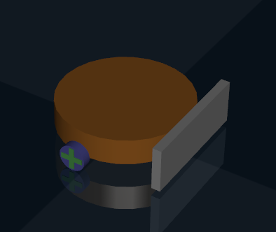
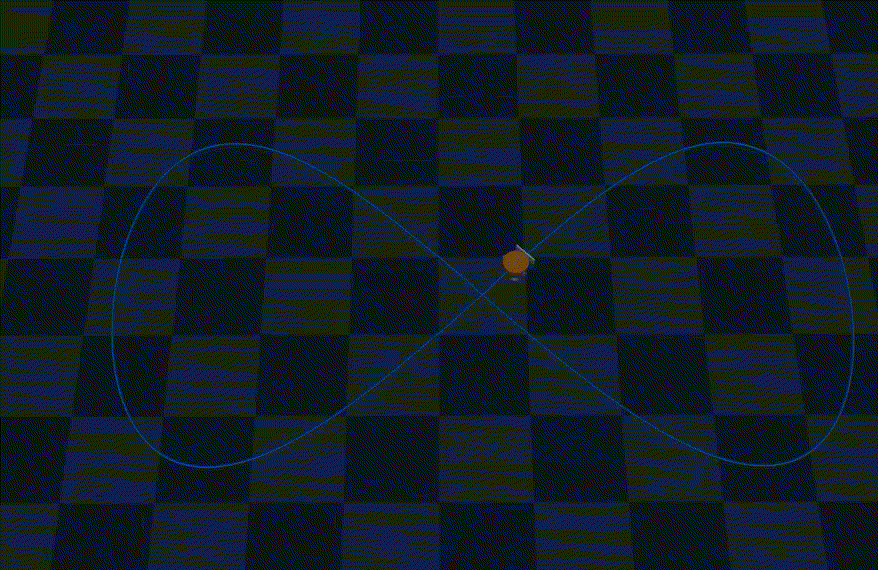

# Simulation Platform for Single/Multi Agent System
This is a repo for multi agent system simulation built upon MUJOCO. It now has several features:   
1. Single/multi robots
    - Differential-drive Mobile Robot
    - A Scene Generator for generating any number of robot and particles 
2. Sensing
    - Top Down Camera Calibration and Detection
    - Real-time Contour Reconstruction
3. Control
    - Keyboard Controller
    - PD Controller
    - MPC Controller
4. Planning 
    - A* on 2D GridMap
    - RRTConnect(ompl)
    - kinodynamic RRT(ompl)
5. Learning
    - Reinforcement Learning

## Installation (Ubuntu 22.04):

1. create your workspace
```
mkdir ws && cd ws
```

2. clone
```
git clone git@github.com:KANZEZ/m0.git
```

3. create your own virtual env
```
python3 -m venv your_env
```

4. in your virtual env, install the packages
```
pip3 install -e . 
```

5. run some examples in m0/examples folder to see if success

6. if you want to use mpc, please follow the install instruction for [acados](https://docs.acados.org/installation/index.html).


## Usage & Demo

### Differential-drive Mobile Robot
Differential-drive mobile robot.    
State: [x, y, $\theta$]     
Control input: [v, w]    
Dynamics: [$\dot x$, $\dot y$, $\dot \theta$] = [v $cos\theta$, v $sin\theta$, w]



### Sensing
A top-down camera is fixed above the playground and can detect the contour of the swarm of particles, and then we use FFT to parametrize and reconstruct the contour.

```
python3 examples/test_contour_recons.py
```


### Control
1. PD control:        

```
python3 examples/test_pid.py
```


2. MPC:

```
python3 examples/test_mpc.py
```



### Planning


1. Multi-agent mppi


2. Geometry Planning(RRTConnect & A* on grid map)   

```
python3 examples/test_astar.py
```
```
python3 examples/test_rrtc.py
```


   

3. Kinodynamic RRT(consider robot dynamics)  

```
python3 examples/test_kinorrt.py
```
  


### Learning
1. RL

```
python3 examples/test_rl.py
```


